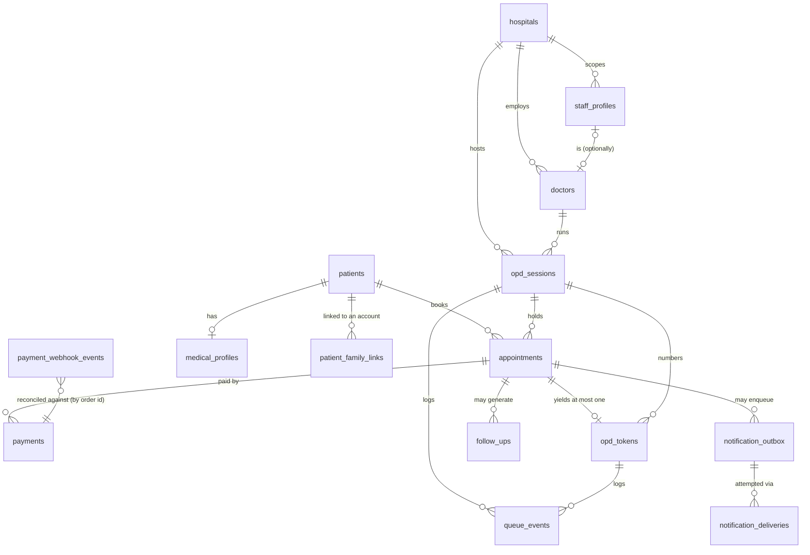

# Data Model

Module 2. The source of truth for every entity in the product, and the place
where PRD §6's business rules stop being prose.

The organising principle is stated once and applied everywhere: **every rule
that can be a database constraint is a database constraint.** Not a check in an
Edge Function, not a guard in the mobile app. Token issuance has to survive
concurrent webhooks, client retries and partial failures, and application-layer
guards do not survive those. Unique indexes and transactions do.

---

## 1. Shape



Four groups, in dependency order:

| Group               | Tables                                                                             |
| ------------------- | ---------------------------------------------------------------------------------- |
| Tenancy & catalogue | `hospitals`, `staff_profiles`, `doctors`, `opd_sessions`                           |
| Patient identity    | `patients`, `patient_family_links`, `medical_profiles`, `device_push_tokens`       |
| Transactional core  | `appointments`, `payments`, `payment_webhook_events`, `opd_tokens`, `queue_events` |
| Downstream          | `notification_outbox`, `notification_deliveries`, `follow_ups`, `audit_log`        |

Plus two reference tables that are data, not configuration:
`appointment_transitions` and `token_transitions` (§5).

---

## 2. Where each PRD §6 rule lives

| Rule    | Enforced by                                                                  | Proof                                      |
| ------- | ---------------------------------------------------------------------------- | ------------------------------------------ |
| §6.1    | `opd_tokens.appointment_id UNIQUE`, `one_successful_payment_per_appointment` | `constraints.test.sql`, violations 1 and 7 |
| §6.2    | `payments_match_appointment` trigger                                         | violations 4–5                             |
| §6.3    | `payment_webhook_events UNIQUE (gateway, event_id)`                          | violation 8                                |
| §6.4    | `pending_requires_expiry` CHECK                                              | violation 13                               |
| §6.5    | `opd_tokens UNIQUE (session_id, token_number)`                               | violation 2                                |
| §6.6    | `queue_events`, `audit_log` + `write_audit_log()` triggers                   | seed produces 41 audit rows                |
| §6.7    | `patient_family_links` (policies land in Module 3)                           | —                                          |
| §6.8    | ETA is absent from every view, by assertion                                  | `views.test.sql`                           |
| §3.1    | `assert_token_is_paid_for()` trigger                                         | violation 3                                |
| PRD §5  | `appointment_transitions` / `token_transitions` + triggers                   | `transitions.test.sql`                     |
| TA §6.1 | `opd_sessions.last_token_number` + `next_token_number()`                     | `verify-token-concurrency.mjs`             |

"violation N" refers to `scripts/invariant-violations.sql`, where every
statement is expected to fail. `pnpm db:invariants` asserts all 21 of them.

---

## 3. The decisions worth arguing about

### Token numbering is a counter column, not a sequence

`opd_sessions.last_token_number` is a plain integer, allocated by
`next_token_number(session_id)` under the row lock that `UPDATE … RETURNING`
takes.

A sequence is the obvious choice and the wrong one: **sequences are
non-transactional.** A rolled-back token issue burns a number, and the patient
series then reads 5, 6, 8. Nobody ever holds 7, the display board never calls
it, and someone in the waiting room asks why. `counter.test.sql` asserts the
rollback case directly.

The cost is that issuers serialize on one row per session. That is the correct
trade: a session is one doctor seeing one patient at a time, and the lock is
held for the length of Module 10's transaction, not the length of a consultation.

### `patients.auth_user_id` is nullable

The single most consequential column in the schema. A dependent child (PRD
PAT-03) and a walk-in registered at reception (PRD G3) are real patients with
real tokens and no login. That one nullable column is what lets app bookings and
walk-ins share **one** queue, instead of two systems that have to be reconciled
by hand at the end of every session.

### The fee is snapshotted on the appointment

`appointments.fee_amount_paise` is a copy of `doctors.consultation_fee_paise` at
booking time, not a join. A hospital raising its fee tomorrow must not change
what a patient was charged yesterday, and Module 10 compares the gateway amount
against _this_ column.

### Family access is a flat grant table

`patient_family_links` has no hierarchy and no recursion. Module 3 has to
express "own record or explicitly linked" as an RLS predicate on every
patient-facing table; a recursive household model makes that policy both slow
and impossible to verify by reading it.

### `ON DELETE RESTRICT` on everything financial and clinical

The only `CASCADE` in the schema is `device_push_tokens.auth_user_id` — a push
token is a property of a device session, carries no history, and a deleted
account must stop receiving notifications immediately. Everywhere else, deleting
a row that has payments or tokens behind it fails (violation 21).

`audit_log.actor_auth_user_id` is deliberately **not** a foreign key: an audit
trail has to outlive the account that produced it.

### ETA is never stored

PRD §6.8 makes ETA advisory. `v_queue_positions` exposes `people_ahead` and
`avg_consult_minutes`; multiplying them is the caller's job, at read time, with
an "estimate" label attached. `views.test.sql` asserts no view has a column
matching `%eta%` — a stored ETA is a promise this product does not make.

---

## 4. Timezones

`hospitals.timezone` is an IANA zone name, defaulting to `Asia/Kolkata`, and it
is validated by a CHECK that simply tries to use it (violation 20).

This column is **not** in the Module 2 approach plan; it is in
`docs/CONVENTIONS.md` §2, which says the hospital's timezone is a column and not
an app-wide constant, "a patient travelling does not change which queue they are
in". Adding it later would have meant a backfill and a migration touching every
session-rendering path.

`opd_sessions.session_date` is a plain `date` in that zone — "the morning
session on 2026-08-20" is a calendar fact, not an instant. Every other timestamp
is `timestamptz`.

---

## 5. The state machines

Legal moves are rows in `appointment_transitions` and `token_transitions`, not
branches in a trigger body. Two reasons, and the second is the important one:

1. A new transition is an `INSERT`, reviewable as data in a migration diff.
2. Module 12's doctor console can `SELECT` the legal next states for a token and
   enable exactly those buttons, instead of re-implementing PRD §5 in TypeScript
   where it will drift.

Both triggers are `UPDATE`-only. The status a row is _created_ with is the
machine's entry point, and which entry points are allowed belongs to the RPC
that creates the row (Modules 8 and 10) — a transition table has no "from" state
to check on insert.

Illegal moves raise **SQLSTATE `ROPD1`**. Postgres reserves the standard error
classes and explicitly sanctions user-defined codes outside them, so a client can
branch on this without string-matching an error message.

### Not yet in the tables

`CONFIRMED → CANCELLED` and `TOKEN_GENERATED → CANCELLED` are absent, and that
is deliberate rather than an oversight. Cancelling after payment is a **refund**,
and the refund policy is an open PRD §10 decision (MODULE-PLAN §11). Adding the
transition now would let a client cancel a paid appointment with no answer to
"and then what happens to the money". `payments.refunded_at` and the `REFUNDED`
status already exist, so the module that settles the policy adds two rows and no
migration to the payments table.

---

## 6. Views

All three carry `security_invoker = true`. Without it a view runs as its definer
and reads straight past Module 3's RLS — a data leak that table-level RLS tests
would still report green, because the tables really are protected. It is the
view that is not. `views.test.sql` asserts the flag on each one, because it is
invisible in every query result.

| View                     | Grain               | For                             |
| ------------------------ | ------------------- | ------------------------------- |
| `v_queue_snapshot`       | one per session     | queue header, counts per status |
| `v_queue_positions`      | one per token       | place in line, `people_ahead`   |
| `v_patient_appointments` | one per appointment | mobile list screens             |

MODULE-PLAN §4.6 asks `v_queue_snapshot` to carry positions. A position is a
per-token fact and cannot live in a view grouped by session, so it became
`v_queue_positions` rather than being dropped.

**"In the line" includes `IN_CONSULTATION`.** The patient currently in the room
is someone you are still waiting for; excluding them under-reports every ETA
behind them by one whole consultation. `SKIPPED` is included for the same
reason — a skipped patient can be recalled at any moment, so counting them
over-estimates rather than under-promises.

---

## 7. Things that surprised us

**Fractional paise are rounded, not rejected.** `insert … values (30000.5)` into
an `integer` column does not fail: Postgres rounds on assignment. Only the _text_
form `'30000.5'` is rejected (SQLSTATE `22P02`, violation 15). The database is
therefore not the last line of defence for this one; the branded `Paise` type in
`@rural-opd/shared` and the ban on `parseFloat` are, and they are why rupees
never become a float upstream in the first place.

**The walk-in exemption on the payment guard.** `assert_token_is_paid_for()`
refuses any token whose appointment has no `SUCCESS` payment — except when
`appointments.source = 'WALK_IN'`, where reception collects cash at the desk and
no gateway payment row exists. The exemption is keyed off a column staff set and
the patient app cannot.

**`pgtap` is not in a migration.** Each test file creates it inside its own
transaction and rolls it back, so an assertion library never exists in a database
holding patient data. `supabase test db` also installs it into the test database
itself, hence the `if not exists`.

**`current_token_number` ≤ `last_token_number` is a CHECK.** Conflating "highest
issued" with "now serving" is the classic queue bug — the waiting-room display
jumps to a number nobody has been called for. They are two columns and the
database refuses to let the called number run ahead of the issued one
(violation 19).

---

## 8. Generated types

`pnpm db:types` writes `packages/shared/src/db.types.ts`. It emits both:

- `Database["public"]["Enums"]` — the types, for exhaustive switches.
- `Constants.public.Enums` — the runtime member arrays.

The Module 2 approach plan assumed the runtime lists would need a second
generated file (`enums.generated.ts`). They do not — the generator already emits
`Constants`, so `packages/shared/src/enums.ts` derives everything from it and
there is one generated artifact rather than two.

`enums.ts` exports named aliases (`AppointmentStatus`, `TokenStatus`, …), the
matching runtime arrays (`TOKEN_STATUSES`, …) for anything that iterates, the
terminal-state sets, and `isDbEnumValue` for narrowing untrusted strings at
boundaries — deep links, push payloads, webhook bodies.

CI regenerates the file and fails on a diff: a migration that changes the schema
without regenerating types is a client compiling against a database that no
longer exists.

---

## 9. Seed data

`supabase/seed.sql`, **local and staging only** — production is seeded through
the staff admin UI (Module 5).

3 hospitals (one inactive, so discovery filtering has something to filter),
8 doctors across 5 specialties, 15 sessions spanning today ±7 days, 6 patients
(three without a login, one account with two linked dependants), and 11
appointments covering every status a screen has to render — including one
walk-in, one mid-checkout, one payment failure and one cancellation.

Every id is a literal UUID. Modules 5–8 build screens against these rows and
Module 15's Maestro flows reference them by id, so an id that changes on every
`supabase db reset` breaks a test suite that has nothing to do with the schema.

Seeded local accounts all use the password `password123`.

---

## 10. Verifying the whole thing

```bash
pnpm db:verify
```

which is:

```bash
pnpm db:reset        # every migration from zero, then the seed
pnpm db:test         # 70 pgTAP assertions across 5 files
pnpm db:invariants   # 21 statements, every one must fail
pnpm db:concurrency  # two real connections contending for the counter
pnpm db:types        # regenerate, then `pnpm typecheck`
```

CI runs all of it on every commit in the `db-tests` job.

---

## 11. Handoff to Module 3

Module 3 receives every table created, **RLS not yet enabled anywhere**, the
`staff_profiles.hospital_id` scoping invariant to lean on (only `SUPER_ADMIN`
may be hospital-less, enforced by CHECK), the flat `patient_family_links` grant
table, three `security_invoker` views that will inherit whatever policies it
writes, and a `db-tests` CI job already running pgTAP that it extends with the
allow/deny matrix rather than creates.
